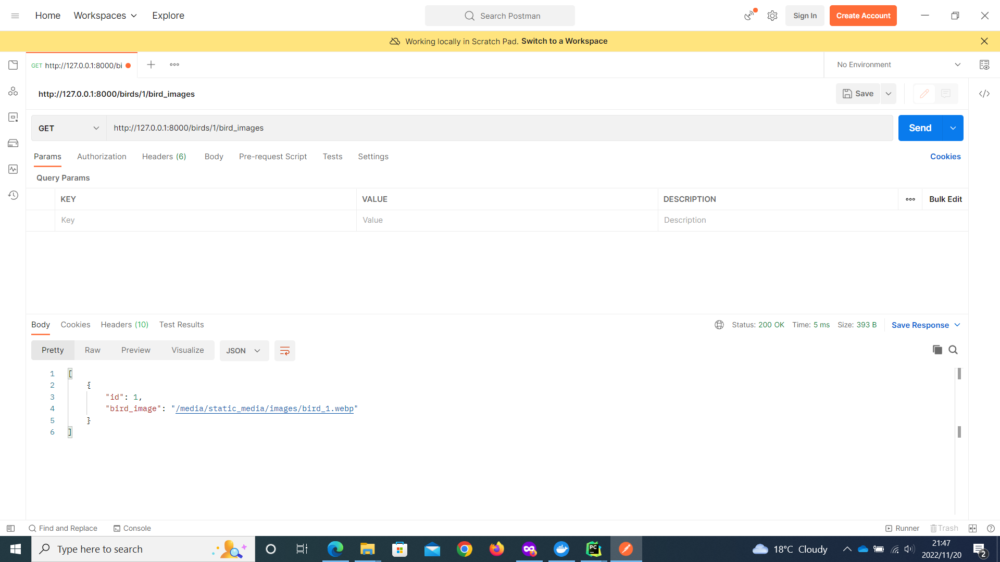
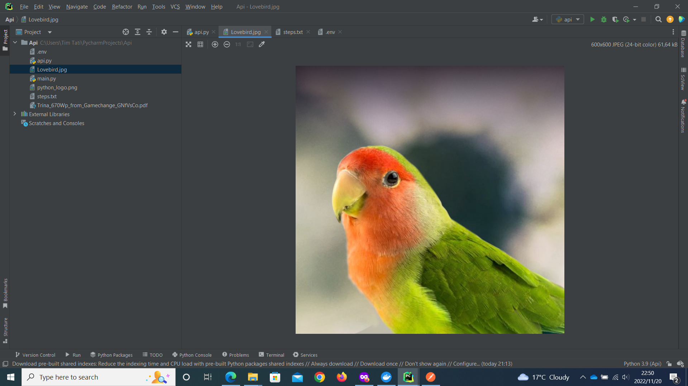

# The Beauty of RESTFUL APIs
There are a multitude of ways of building web applications in this day and age, but in the last couple of years,
APIs have become the go-to way of exposing data to clients. From the weather app on your phone to the search functionality
on your Google Maps app, almost every application these days talks to an API.

## What are APIs?
#### So exactly are APIs?

API is short for **Application Programing Interface**. Building an API is essentially building an interface that client
 apps use to either get or save data, from and to a server app. It's like building a remote control where each button provides a specific functionality.

In a similar note an API will have one or more api enpoints for different purposes. An endpoint is simply one end of a
communication channel. Client apps send requests to these endpoints to get or save data.

## What makes APIs RESTFUL?
REST stands for **Representational State Transfer** - It's one of those terms that only very smart PhD students can actually
understand, I know, but in practical terms REST simply defines a set of rules for clients and servers, to communicate over the web.
Following such rules helps us build systems that are scalable, fast, reliable, easy to understand and easy to change. 
An API that conforms to such rules is called **RESTFUL**. 

#### What are these rules?
Entire books have been written on RESTFUL APIs rules and concepts, but, on practical terms, there are three main rules that 
everyone should be aware of:
+ Resources
+ Resource Representations
+ HTTP methods

There will be a little more insight to some of these rules when I cover a practical example at a later stage.

## Why use RESTFUL APIs?
#### So why exactly should you use RESTFUL APIs?
The first reason to use APIs is security. The data from the client app is never fully exposed to the server and likewise, the server
is never fully exposed to the client. Instead, they both communicate using small packets of data and share only what's 
necessary.

Another reason would be convenience. For instance, instead of building a website that provides information on shops around
your area, you would build an API that could then be accessed by, virtually, any other app -be it mobile, a computer app
or even a simple script -that requires information contained in the API or part of the information. It also makes designing 
applications for specific platforms much easier because there is no need to concern yourself with how or where to store data.

With all that said let's move on to an actual practical example.

---
# Using a script to get images from API endpoints

As a fairly simple example of a real case usage of API endpoints, I have a build a small API using 
__[Django REST framework](https://www.django-rest-framework.org/)__, and with a simple python script,
I will download images found on said endpoints to my local machine.

```
# The python Script:

media_url = "some_url"
parsed_url = parse.urlsplit(media_url).path
image_name = parsed_url.split("/")[-1]

response = requests.get(media_url)  # create HTTP response object
with open(image_name, 'wb') as file:
    file.write(response.content)
```

But before we start download the image files, there is a need to verify that the API endpoints actually work, and for that
we will be using __[Postman](https://www.postman.com/)__- an API platform for devs to build, design and test their APIs. We
can accomplish that by sending a GET request to endpoint where we expect to find the images:



To explain what just happened, a GET request was sent to the endpoint `http://127.0.0.1:8000/birds/1/bird_images`.
The Status 200 on the response implies that the API call to the endpoint was successful and a JSON object was returned, 
containing the image and the ID of the image.

The first key concept that needs to be understood when it comes to RESTFUL apis is the concept of *Resources*.
Resources are available on the web and client applications can access them using a URL, which in this particular case was
 done through `http://127.0.0.1:8000/birds/`.


*[URL]: Uniform Resource Locator

*Resource Representation* has to do with the way the server returns the requested resource. In this particular example
the resource was returned in JSON format but the same data could also be returned as HTML or XML.

*HTTP Methods* are related to the operations supported by the API endpoints. Some endpoints may allow to modify data while
others may only allow you to read. HTTP defines methods such as:
+ GET -for getting a Resource
+ POST -for creating a resource
+ PUT -for updating a resource
+ PATCH -for updating just part of a resource
+ DELETE -for deleting a resource

Now that it is confirmed that we can get resources from the API endpoint, all left to be done is pass a URL endpoint to 
the script and download an image. Replace `"some url"` with `"http://127.0.0.1:8000/media/static_media/images/Lovebird.jpg"` 
and run the script.

```angular2html
import requests
from urllib import parse


media_url = "http://127.0.0.1:8000/media/static_media/images/Lovebird.jpg"
parsed_url = parse.urlsplit(media_url).path
print(parsed_url.split("/"))
datasheet_name = parsed_url.split("/")[-1]
print(datasheet_name)

response = requests.get(media_url)  # create HTTP response object
with open(datasheet_name, 'wb') as file:
    file.write(response.content)

```

And that's it. The image file gets directly downloaded into a folder in your computer. In my case, the image is downloaded
to the directory where the python script is running. The script can be altered to dynamically loop over multiple endpoints and download 
multiple images at once, but I would rather keep the example simple.

Image downloaded:



